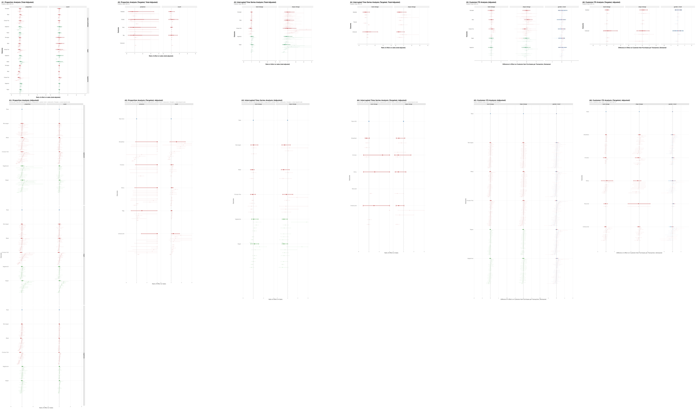
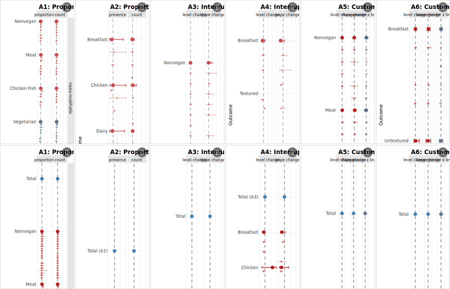

# Alt-Protein Sales Effects

Bayesian forest-plot analysis of restaurant menu changes. The interactive
HTML grid in `present/` is the primary deliverable: click any restaurant or
pooled estimate dot to open that fit's prediction plot in a new tab.

## Static preview



Above is a downsized snapshot of the 2×6 forest-plot grid (T1 row + T2 row,
A1–A6). Each cell summarizes per-restaurant and pooled estimates. The full
interactive version with click-to-open prediction plots lives in `present/`.

## Interactive HTML (recommended)

Open any of these locally to interact with the plotly widgets — click a
restaurant or pooled estimate to open its prediction plot:

- `present/base/grid_both_sorted.html` — non-adjusted, sort by mean
- `present/total_adjusted/grid_both_sorted.html` — adjusted, sort by mean
- `present/base/grid_both.html` / `present/total_adjusted/grid_both.html` —
  unsorted variants

Open in a browser:

```
xdg-open present/total_adjusted/grid_both_sorted.html        # Linux
open present/total_adjusted/grid_both_sorted.html            # macOS
start present/total_adjusted/grid_both_sorted.html           # Windows
```

The grid HTML iframes the per-analysis plot HTMLs (`A1_*.html`, `A2_*.html`,
…). Each one carries its own plotly widget plus a click handler that opens
the matching `.png` from `present/model_fits/.../plots/` in a new tab.

### Click-to-open demo



Three frames captured headlessly: grid load, hover on a restaurant dot,
the resulting prediction plot opening in a new tab.

## Reproducing

Two one-liners at the repo root regenerate everything:

```sh
bash rerun_all.sh        # all 5 R scripts × 4 modes + both grids
bash rerun_t1_png.sh     # T1 PNGs only (forest_plots/, both sort modes)
```

Per-plot layout is tunable via `publication/plot_config.R`; uniform
publication styling lives in `publication/publication_config.R`. Edit the
relevant entry, re-run the affected script, see the change.

## Layout

- `model_scripts/` — Stan models + R drivers
- `model_fits/` — fitted samples + per-restaurant pred plots
- `forest_plots/` — output directory (PNGs, PDFs, plotly HTMLs)
- `present/` — self-contained bundle of HTMLs with bundled pred plots
- `publication/` — config files, theme, render scripts
- `tools/validate_forest_html.py` — programmatic spacing audit for the HTMLs
