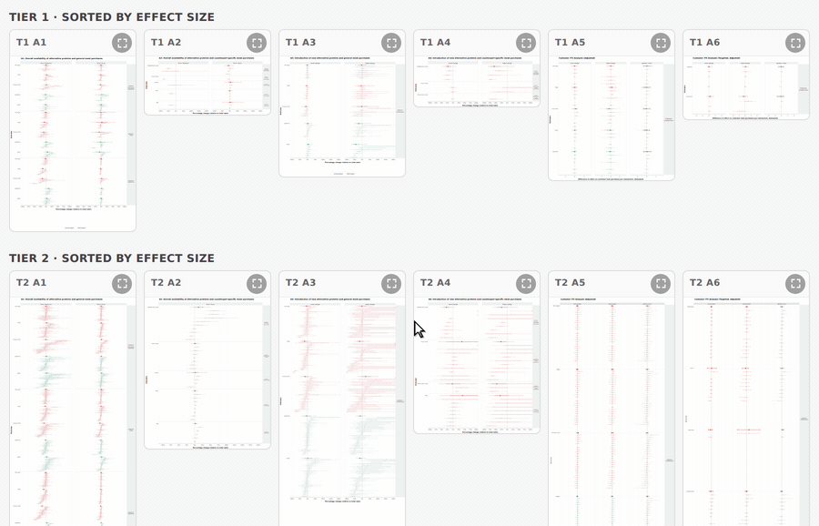

# Alt-Protein Sales Effects
**Using restaurant sales data to determine if introducing alternative proteins reduces animal-based purchases. Designed and optimized a fully custom Stan model for forecasting sales and estimating effects.**

*STATUS: Modeling Pre-LLM, Plotting Post-LLM*

This repo is one component of larger [project](https://osf.io/preprints/socarxiv/tpyk9_v1) by **[HSFL](https://www.foodlabstanford.com/) at Stanford University**, specifically the **modeling and results half**.
It takes the modeling dataset and produces the fits, estimates, and final figures. The data pipeline that builds that dataset lives in
[restaurant-sales](https://github.com/hsflabstanford/restaurant-sales).

**Results**: https://hsflabstanford.github.io/restaurant-sales/

**Note:** This analysis consists of 6 separate analyses (done over two sets of restaurants, so 12 total), with forest plots of effects estimates that can be visualized as shown below.

## Preview

Below, are estimates from ~130 separate multilevel models, each containing a varying number of restaurants. The bold point estimates represent pooled-over-restaurant rate ratios (aka multiplicative effects) for specific outcomes and exposures, while the smaller points represent the same for individual restaurants. When you click the point estimate, the prediction plot (in-sample and out-of-sample) for that restaurant is shown.




Each grid iframes that bundle's per-analysis plot HTMLs (Tier 1: A1–A6; Tier 2:
A1a/b/c, A2, A3a/b, A4, A5, A6 — `PUB_WIDE` splits T2 A1 and A3 across pages).
Every plot carries its own plotly widget plus a click handler that opens the
matching `.png` from `present/model_fits/.../plots/` in a new tab.

### Viewing them interactively

https://jaredwins99.github.io/alt-protein-sales-effects/

| | link |
|---|---|
| Sorted / unlabeled | https://jaredwins99.github.io/alt-protein-sales-effects/total_adjusted/grid_sorted.html |
| Labeled | https://jaredwins99.github.io/alt-protein-sales-effects/total_adjusted/grid_labeled.html |

To re-publish after a `render_present.sh` rebuild:

```bash
rsync -a --delete --exclude .git present/ ~/ghp-alt-protein/ && cd ~/ghp-alt-protein && git add -A && git commit -m "publish rebuilt bundles" && git push origin gh-pages
```

**Locally:** clone and open either `grid_*.html` in a browser. Works offline.

The HTMLs are *not* self-contained — each has a sibling `*_files/` directory
holding its plotly assets — so whatever serves them must serve those too.
Relative paths resolve under all of the above.

## Layout

- `model_scripts/` — R drivers for processing, model fitting, and fit extraction
- `model_fits/` — fitted samples + per-restaurant pred plots
- `publication/forest_plots/` — effect estimate plot directory (PNGs, PDFs, plotly HTMLs)
- `publication/` — forest plot R scripts + grid splicing + docs assets
- `present/` — interactive HTML bundles (sorted + labeled) with bundled pred plots

## Reproducing

The clone is about 6.5 GB — it ships the 131 posterior-draw summaries and the
per-restaurant prediction plots, which is what lets you rebuild every figure and
table without refitting anything. Give it a few minutes on a decent connection.

### Setup

**Windows** — install [Miniconda](https://docs.conda.io/en/latest/miniconda.html),
[R 4.4.2](https://cran.r-project.org/bin/windows/base/old/4.4.2/) and
[Node](https://nodejs.org) (Node only for the interactive bundle). Open
**Anaconda Prompt**, then `cd` to the repo folder.

**macOS / Linux** — install Miniconda, R 4.4.2 and Node. Open a terminal, then
`cd` to the repo folder.

**Both, then:**

- Python: any Python 3. The pipeline uses only the standard library, except the
  two design-diagram steps, which need `matplotlib` and `numpy`
  (`pip install matplotlib numpy`). Pass `--skip-diagrams` to omit them.
- Set up R. Run `R` from the repo root and enter:
  - `renv::activate()`
  - `renv::restore()` — takes a while
  - `quit()`
- For the interactive bundle only: `npm install`
- Check it worked: `Rscript -e 'packageVersion("ggh4x")'` → `0.2.8`

R must be **4.4.2**, and `renv::restore()` must run with the project
active — never `Rscript --vanilla -e "renv::restore()"`, which compares against
your system library, reports success, and installs nothing. This repo has its
own lockfile, separate from `restaurant-sales`.

**CmdStan is a separate pin, and `renv` does not cover it.** `renv.lock` pins the
`cmdstanr` R package (0.9.0); CmdStan itself is a C++ toolchain installed outside
renv. The published fits were produced under two versions:

| CmdStan | fits | by era |
|---|---|---|
| 2.36.0 | 72 | `_trunc` 52, `_cp` 15, `_uncontaminated2` 5 |
| 2.38.0 | 59 | `_cp` 34, `_uncontaminated` 3, `_uncontaminated2` 22 |

2.38.0 is what `.Rprofile` expects and what the plots and tables were built
against. Install it explicitly — `install_cmdstan()` with no version takes
whatever is newest that day:

```
Rscript -e 'cmdstanr::install_cmdstan(version = "2.38.0")'
```

2.36.0 produced the majority of the fits and is needed to re-fit those, but
nothing in the published pipeline requires it: the plots and tables are rebuilt
from committed draws, not from Stan. The split is a machine artefact rather than
a modeling choice — those fits ran on a second box that had 2.36.0 installed.
See `publication/TOOLCHAIN.md`.

### Run

```
python run_pipeline.py
```

Rebuilds the plots and tables from the committed draws in about two minutes.

- `--skip-html` omit the interactive bundle · `--skip-diagrams` omit the design
  diagrams · `--list` show the steps · `--from N` resume partway
- `--from-fits` re-extract draws from `model_fits/` (hours)
- `--refit` refit all 12 analyses first (days)

```
  data/4_data_parquet_modeling/       handoff from restaurant-sales
        |
        |  model_starters/            --refit only · days
        v                             A1-A4 INGARCH · A5-A6 Gaussian IID, day level
  model_fits/                         184 GB locally · only 206 MB of it is
                                      committed (summaries + prediction plots);
                                      the posterior samples are not distributed
        |
        |  slim_extract_one.R         --from-fits only
        v
  publication/published_draws/        131 files · 53 MB · committed
        |                             <-- a default run starts here
        |  adj_join_pass2.R
        v
  publication/forest_data_adj_95ci_fixed.csv
        |
        +--> render_professional_wide_fixed.R -> forest_plots/professional_wide_fixed/  sorted
        +--> render_professional_labeled_v2.R -> forest_plots/professional_labeled_v2/  labeled
        +--> final_tables.R                   -> tables_final/   tables, unadjusted RR
        +--> render_present.sh                -> present/        interactive HTML

  publication/exposure_design_diagram{,_latex}.py
          |                             independent of the draws; matplotlib
          v
  publication/exposure_design_diagram.png
  publication/exposure_design_diagram_latex.{png,pdf}   the A1-A6 design figure
```

The forest plots report the **relative rate ratio (RRR)**; the tables report the
**unadjusted RR**. Both describe the same estimates.

A5 and A6 are the customer models, fitted at the **day** level. The
`*_transaction` starter directories are model-selection leftovers and nothing
published reads them — see `publication/MODEL_MAP.md`.
