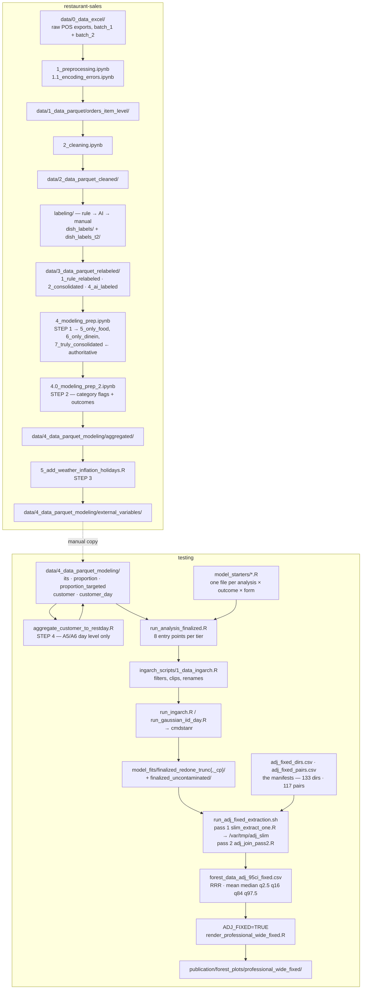

# Workflow sequence — end to end, across both repos

Written 2026-08-01, re-verified 2026-08-04. **Parts are now out of date** —
`PIPELINE.md` in this directory carries the corrections from an end-to-end
reproduction run and supersedes this file wherever the two disagree,
particularly on the labeling passes, `dish_counts`, and which environment
reproduces the published values. Covers every stage
from raw Excel exports to the publication figures, which scripts are live, which
are antiquated, and where data lands at each hop.

> **2026-08-04 revision.** The extraction section of the original was wrong in
> four places and has been rewritten from source. In particular `extract_95ci.R`
> has never written `forest_data_adj_95ci.csv` (it writes the *unadjusted*
> `forest_data_95ci.csv`, at `:19` and `:233`), and it **cannot currently run at
> all** — see [Extraction](#testing--extraction-and-figures). The corrected
> pipeline is `run_adj_fixed_extraction.sh` → `forest_data_adj_95ci_fixed.csv`.
> Everything on the `testing` side below, and the handoff, was re-verified. The
> `restaurant-sales` stage list was verified structurally (directories, outputs,
> file dates); its in-notebook specifics — cell numbers, the line-toggle
> procedure, the pandas pin — are carried over from the original audit and were
> not re-executed.

Two repos:

| repo | role |
|---|---|
| `restaurant-sales` | data construction — raw POS exports → model-ready parquets |
| `testing` (`alt-protein-sales-effects`) | modelling, extraction, figures |

The handoff is a **manual copy** of 21 parquet files. There is no automated
sync; see [The handoff](#the-handoff) for the exact mapping. **Verified current
as of 2026-08-04**: all 21 files are byte-size identical and same-dated
(2026-08-01) on both sides.

Companion document: `publication/PIPELINE.md` is the deep dive on the extraction
and render stage (stages 10–13 here) — the `ADJ_FIXED` switch, the two-pass
extractor, per-file status, and the verification recipe. This document is the
end-to-end map; that one is the detail for the last third of it.

---

## Diagram



---

## Stage by stage

### `restaurant-sales` — data construction

| # | script | in | out |
|---|---|---|---|
| 1 | `1_preprocessing.ipynb` (+ `1.1_encoding_errors.ipynb`) | `data/0_data_excel/batch_{1,2}/` | `data/1_data_parquet/orders_item_level/` |
| 2 | `2_cleaning.ipynb` | ↑ | `data/2_data_parquet_cleaned/orders_item_level/` |
| 3 | `labeling/` (see below) | ↑ | `data/3_data_parquet_relabeled/{1_rule_relabeled,2_consolidated,4_ai_labeled}/` |
| 4 | `4_modeling_prep.ipynb` — **STEP 1** | ↑ + `grouping_mappings.pkl` | `3_data_parquet_relabeled/5_only_food/`, `6_only_dinein/`, `7_truly_consolidated/` |
| 5 | `4.0_modeling_prep_2.ipynb` — **STEP 2** | `7_truly_consolidated/` | `4_data_parquet_modeling/aggregated/` |
| 6 | `5_add_weather_inflation_holidays.R` — **STEP 3** | `aggregated/` + weather + CPI | `4_data_parquet_modeling/external_variables/` |

`5_format_weather_and_inflation_data.R` is a **prerequisite**, run once, producing
`data/weather_data/finalized_weather_data/weather_data.csv` and the CPI table.
It does not need re-running unless the coverage window changes.

**Run order is strict — 4 → 4.0 → 5.** Step 2 is the memory hog (15.8 GB peak,
~4 min; steps 1 and 3 are 1:20/4.0 GB and 1:19/1.0 GB).

#### The labeling subtree

`scripts/labeling/` holds the dish-level ground truth:

| path | contents |
|---|---|
| `dish_labels/` | **Tier 1** per-restaurant CSVs, one row per dish, one boolean column per category |
| `dish_labels_t2/` | **Tier 2** — superset, `<RESTAURANT>_1.csv` naming |
| `dish_labels_backup/` | snapshot, not read by the pipeline |
| `dish_counts/` | per-dish unit tallies used for auditing |
| `ai_grouping/`, `labeling_1/`, `labeling_2/`, `remapping/` | intermediate stages of the rule → AI → manual labeling |
| `checking_labels.ipynb`, `labeling_template.ipynb` | interactive tools |

The 14 category columns are: `lamb`, `chunked_beef_or_pork`, `pulled_pork`,
`beef_or_pork_burger`, `ground_meat`, `meatballs`, `sausage`, `bacon`,
`breakfast_sausage_patty`, `unfried_chicken`, `fried_chicken`, `savory_dairy`,
`sweet_dairy`, `egg`.

#### Where outcomes are actually built

`4.0_modeling_prep_2.ipynb` **cell 2** — `category_mappings` (per-category
include/anti keyword regexes) and the mask chain that turns label-CSV joins into
transaction-level flags. This is the file to edit for any labelling-logic fix;
`4.3_targeted_categories.ipynb` only makes things binary and is **not** where
construction happens.

**cell 3** builds the general outcomes, **cell 4** the targeted ones, **cell 6**
aggregates to restaurant-day.

### The handoff

Manual copy, `restaurant-sales/data/4_data_parquet_modeling/external_variables/`
→ `testing/data/4_data_parquet_modeling/`:

| source | dest | files |
|---|---|---|
| `its/` | `its/` | 1 |
| `proportion/` | `proportion/` | 6 |
| `proportion_targeted/` | `proportion_targeted/` | 12 |
| `customer/` | `customer/` | 2 |

`testing`'s `a2_proportion_t/` is a **symlink to `proportion_targeted/`** — do not
copy into both, they are the same directory.

No rename is needed. Both sides carry `*_outcome_p`; `1_data_ingarch.R:133`
conditionally renames to `*_p_outcome` at load time.

### `testing` — modelling

| # | script | role |
|---|---|---|
| 4 | `model_scripts/customer_analysis/level_day/aggregate_customer_to_restday.R` | **STEP 4** — the only stage `restaurant-sales` does not produce. Reads `customer/finalized_transactions_customers.parquet`, demeans per customer, aggregates → `customer_day/finalized.parquet` (~5 min, 4.4 GB) |
| 5 | `model_starters/<family>/<A#>_<outcome>_<form>.R` | thin config: outcome, exposure, restaurant list, price predictor, output dir |
| 6 | `model_scripts/analysis_scripts/run_analysis_finalized.R` | 8 entry points per tier, resolves the data file |
| 7 | `model_scripts/ingarch_scripts/1_data_ingarch.R` | universal date filters, clip tables, `*_outcome_p` → `*_p_outcome` rename |
| 8 | `model_scripts/ingarch_scripts/run_ingarch.R` | builds the Stan data list, calls cmdstanr |
| 9 | `model_fits/<directory>/<analysis>/<outcome>/<exposure>/` | `fit.rds`, `samples.rds`, `restaurants_order.rds` |

Starters are launched directly (`Rscript model_starters/.../A2_dairy_count.R`) or
in batches via `bash_scripts/running/*.sh` locally, `bash_scripts/slurm/*.sh` on
Sherlock. `bash_scripts/moving/` holds the scp helpers.

### `testing` — extraction and figures

**This is the section the original document got wrong.** Verified from source
2026-08-04.

| # | script | role |
|---|---|---|
| 10a | `publication/scripts/adj_fixed_{dirs,pairs}.csv` | the manifests — 133 model dirs (pass 1), 117 outcome/total pairs (pass 2). **These decide which fit generation each analysis reads from** |
| 10b | `publication/scripts/run_adj_fixed_extraction.sh` | driver. Pass 1 `slim_extract_one.R`, one subprocess per fit → `/var/tmp/adj_slim` (~54 MB). Pass 2 `adj_join_pass2.R` → `publication/forest_data_adj_95ci_fixed.csv` |
| 11 | `publication/scripts/adj_fallback.R` | CSV reader shared by the renderers; holds the `ADJ_FIXED` switch |
| 12 | `create_forest_plots_restaurants_chosen_recolored_adj{,_t2}.R` | A1–A4 forest plots, T1 and T2 |
| 12b | `create_customer_day_forest_plots_consolidated.R` | A5/A6, both tiers. Reads **both** `forest_data_95ci.csv` (non-adjusted panels) and the adjusted CSV |
| 13 | `publication/render/render_professional_wide_fixed.R` | sets `ADJ_FIXED=TRUE` (`:66`) and sources the three sub-renderers |
| 14 | `publication/forest_plots/professional_wide_fixed/` | the 15 shipped PDFs — 6 T1, 9 T2 |

**Renderers read the CSVs, never `samples.rds`.** Samples are multi-GB; loading
them at plot time is the thing this split exists to avoid.

#### Corrections to the original stage table

| original claim | verified reality |
|---|---|
| `extract_95ci.R` → `forest_data_adj_95ci.csv` | It writes `forest_data_95ci.csv` — the **unadjusted** file (`:19`, `:233`). It has never produced the adjusted one |
| `forest_data_adj_95ci_fixed.csv` is an "intermediate pass" | It is the **current** output, and the only CSV the figures are built from |
| `adj_fallback.R`, `adj_join_pass2.R` are "one-off repair passes" | Both are **load-bearing** on the live path |
| `forest_data_95ci.csv` "superseded by `forest_data_adj_95ci.csv`" | Backwards. `forest_data_95ci.csv` is **live** (A5/A6 non-adjusted panels); `forest_data_adj_95ci.csv` is the retired Bug-1 file |

#### `extract_95ci.R` is currently broken

```r
DEFAULT_ROOTS <- c(
  "model_fits/finalized_redone_trunc",
  "model_fits/finalized_redone_trunc_cp",     # <- trailing comma
)
```

The file parses, but evaluating that `c()` raises **`argument 3 is empty`**, and
`DEFAULT_ROOTS` is assigned before the `args` check, so it fails regardless of
arguments. The comment says "the three publication-relevant roots" while listing
two — the removed third was `finalized_redone_trunc_cp2`, which is also absent
from disk yet still accounts for 172 A5/A6 rows in the committed
`forest_data_95ci.csv`. (Those runs were folded into `_cp`.)

Consequence: `forest_data_95ci.csv` is frozen at 2026-05-03 and cannot currently
be regenerated without repairing the script.

#### Verdict: retire the script, keep its output on disk

Verified 2026-08-04 that `forest_data_95ci.csv` feeds **no shipped figure**.
Every A5/A6 artifact produced on the `ADJ_FIXED` path carries an `_adj` suffix —
no non-adjusted output is generated there — and only two A5/A6 PDFs are copied
into `professional_wide_fixed/`, both adjusted and day-level.

So `extract_95ci.R` is **retired**: it is broken, nothing re-runs it, and its
output reaches no figure. RR values now come from pass 2 instead (see
[Outstanding](#outstanding--decided-not-yet-done)).

> ⚠ **Do not delete or move `publication/forest_data_95ci.csv`.**
> `create_customer_day_forest_plots_consolidated.R:651` does
> `read.csv(NON_ADJ_CSV)` with **no `file.exists` guard**, so removing the file
> crashes the A5/A6 renderer and therefore the whole
> `render_professional_wide_fixed.R` run. Retiring the *script* is safe; the
> *artifact* must stay until that read is made conditional.

Env-var switches consumed by the renderers: `SORT_BY_MEAN`, `PUB_RECENTER`,
`PUB_WIDE`, `LABELED_MODE`, `LABELED_V2`, `WIDE_LABELED`, `PRO_ONLY`, `PRO_TIER`,
`PRO_FAST`. Layout constants live in `publication/config/plot_config.R`
(`PLOT_CONFIG` + `WIDE_OVERRIDES` + `LABELED_OVERRIDES`, merged by
`get_plot_cfg()`) and `publication/config/publication_theme.R`.

---

## Which fit generation each analysis reads from

Verified 2026-08-04 from `adj_fixed_pairs.csv` against what is on disk. **The
manifest is the authority** — a starter's `directory =` says where a *future*
run would land, not where the current numbers come from.

| analysis | manifest reads | fits on disk |
|---|---|---|
| `a1_proportion`, `a3_its` | `_trunc` / `_cp` | ✅ |
| `a2_proportion_t` (T1) | **`_uncontaminated`** (10) | ✅ 10 |
| `a4_its_t` (T1) | **`_uncontaminated`** (3) | ✅ 3 |
| `a6_customer_t_day` (T1) | **`_uncontaminated`** (2) | ✅ 2 |
| `a5_customer_day` (T1) | `_cp` (5) | ✅ 6 |
| `t2_a1_proportion`, `t2_a3_its` | `_trunc` / `_cp` | ✅ |
| `t2_a2_proportion_t` | `_trunc` (12) | ⚠ 0 in `_uncontaminated` |
| `t2_a4_its_t` | `_trunc` (2) + `_cp` (3) | ⚠ 0 in `_uncontaminated` |
| `t2_a5_customer_day` | `_cp` (5) | ✅ 6 |
| `t2_a6_customer_t_day` | `_cp` (5) | ⚠ 0 in `_uncontaminated` |

**Rule going forward:** anything re-run on Sherlock outputs to
`finalized_uncontaminated`. T1 targeted is fully migrated; **all T2 targeted is
not** — 22 models (12 A2, 5 A4, 5 A6).

### Starter routing does not yet match that rule

Of the 37 targeted starters, only **5** say `finalized_uncontaminated`
(`t2_a2_proportion_t/A2_T2_textured_{count,presence}`,
`t2_a4_its_t/A4_T2_textured`, `customer_targeted/A6_{breakfast,untextured}`).
The other 32 still say `finalized_redone_trunc_cp`.

That includes the 13 T1 A2/A4 starters **whose fits already live in
`_uncontaminated`** — they were pointed there when run, then reverted. Re-running
any of them today would write to `_cp` while extraction keeps reading
`_uncontaminated`.

> ⚠ **`bash_scripts/slurm/slurm_t2_a2_a4_batch1.sh` is staged to submit 13 T2
> models that all output to `finalized_redone_trunc_cp`.** Repoint those starters
> before submitting, or the batch lands in the wrong generation.

### Canonical customer analysis: **day-level**

Settled 2026-08-04 from three independent signals:

- the manifest references only `*_customer_day` / `*_customer_t_day` (17 pairs); **zero** transaction-level
- the two shipped A5/A6 PDFs are both `gaussian_iid_day`
- transaction-level fits live under `z_`-prefixed directories
  (`z_a5_customer_transaction`, `t2_z_a6_customer_t_transaction`, …), matching the
  renderer's own `A5_gaussian_iid_forest_*` → `z_A5_transaction_*` rename

So `run_customer_day` / `run_customer_targeted_day` / `run_customer_t2_day` /
`run_customer_targeted_t2_day` → `run_gaussian_iid_day` is the published path.
The four transaction-level entry points → `run_gaussian_iid` are supplementary.

---

## Analyses → data files

Six analyses × two tiers, but **eight** `run_*` entry points per tier, because A5
and A6 each have a day-level and a transaction-level variant. Files are shared:

| entry point | analysis | data file | affected by the contamination fix? |
|---|---|---|---|
| `run_proportion` | A1 general availability | `proportion/finalized_<expo>.parquet` | no |
| `run_prop_targeted` | A2 targeted availability | `a2_proportion_t/finalized_<expo>.parquet` | **yes** |
| `run_its` | A3 general ITS | `its/finalized.parquet` | no |
| `run_its_targeted` | A4 targeted ITS | `its/finalized.parquet` *(same file)* | **yes** |
| `run_customer_day` | A5 within-customer, day | `customer_day/finalized.parquet` | no |
| `run_customer` | A5 within-customer, transaction | `customer/finalized_transactions_customers.parquet` | no |
| `run_customer_targeted_day` | A6 targeted, day | `customer_day/finalized.parquet` *(same file)* | **yes** |
| `run_customer_targeted` | A6 targeted, transaction | `customer/finalized_transactions_customers.parquet` *(same)* | **yes** |

A3/A4 and A5/A6 differ only in which columns they select, which is why 21 files
cover 16 entry points.

Tier 2 entry points are the same functions in the second half of
`run_analysis_finalized.R`, fed by `model_starters/t2_a*/`.

---

## Gotchas that will bite

### Environment must be pinned
Run the notebooks under `env/environment_linux.yml` (conda env `palate1`:
python 3.9.25, pandas 2.1.3, numpy 1.22.4, pyarrow 14.0.1). **pandas 3.0 silently
corrupts** numeric dish-count columns into `'True'`/`'False'` strings. Set
`PYTHONPATH=/home/godli/restaurant-sales/src` **absolute** — the notebook calls
`os.chdir(PROJECT_ROOT)`, so a relative path breaks.

### R invocation
`.Rprofile` sources a missing `renv/activate.R`, so `--vanilla` is required — but
that drops `R_LIBS_USER`. Use:
```
Rscript --vanilla -e '.libPaths(c("/home/godli/R/x86_64-pc-linux-gnu-library/4.3", .libPaths())); source("<script>")'
```

### The transactions file needs manual line swaps
`5_add_weather_inflation_holidays.R` processes the 20 **daily** aggregates and
excludes `transactions`. To produce
`customer/finalized_transactions_customers.parquet` you must toggle four lines:

| line | daily | transactions |
|---|---|---|
| 125–126 | commented | **active** — casts `created_at` to a date before joining |
| 127 | active | commented |
| 135 | active | commented |
| 136 | commented | **active** — the `all_locations_transactions → finalized_transactions` rename |

Lines 125–126 are not cosmetic. `created_at` is POSIXct in the transaction-level
data; the direct join at line 127 matches almost nothing — **73 % NA weather**,
and the 27 % that survive are biased to overnight rows (mean temp 2.9 °C vs the
correct 14.0 °C). No error is raised.

### `4.0_modeling_prep_2.ipynb` always exits 1
Cell 12 reads `all_locations_transaction_customers.parquet` (singular) while cell
10 writes `...transactions_customers.parquet` (plural). Cells 13–15 are fully
commented, so **no output is lost** — every data-producing cell runs first. The
non-zero exit is expected; check the files, not the exit code.

Likewise `5_add_weather_inflation_holidays.R` exits 1 on a post-loop `gg_season`
diagnostic (`validate_tsibble` on transaction-level data). Also after the write.

### `*_outcome_p` must be a union, not a sum — FIXED
Historically each `*_outcome_p` was a **sum of 2–3 category flags**, e.g.
`breakfast_outcome_p = 1*sausage + 1*bacon + 1*breakfast_sausage_patty`. Because
`total_outcome = 1` per item row, any dish flagged in two categories of the same
group contributed **2**, and `outcome_p` could exceed `total_outcome`. `egg_p`,
the only single-flag group, was the only one that never exceeded — which is what
identified the mechanism.

The outcome is *counterpart items purchased*, and the unit is one item row. A
Breakfast Burrito is one purchase whether it holds bacon, sausage, or both.
Cell 4 already built the correct boolean union (`breakfast_p = sausage | bacon |
breakfast_sausage_patty`) and used it for the price windows that become
`*_p_price_real` — A2's `extra_price_predictor`. So the outcome and its own price
covariate were defined differently within the same model.

Fixed in `4.0_modeling_prep_2.ipynb` cell 4 by pointing the six outcomes at the
union already computed above, matching the `*_outcome = 1*df['<flag>']` pattern:

```python
breakfast_outcome_p=lambda df: 1*df['breakfast_p'],
textured_outcome_p=lambda df: 1*df['textured_p'],
untextured_outcome_p=lambda df: 1*df['untextured_p'],
chicken_outcome_p=lambda df: 1*df['chicken_p'],
dairy_outcome_p=lambda df: 1*df['dairy_p'],
egg_outcome_p=lambda df: 1*df['egg_p'],
```

Effect: exceedances 2,226 → **0**, and `outcome_p <= total_outcome` now holds by
construction. 221,391 phantom units removed —
`breakfast_p` −15.0 %, `textured_p` −7.4 %, `dairy_p` −1.6 %, `chicken_p` and
`untextured_p` −0.2 %, `egg_p` unchanged. Exactly five columns moved; the other
188 in `its/finalized.parquet` are bit-identical.

**Scope: A2 only, both tiers.** A4 and A6 read `*_outcome` / `*_t2_outcome`,
built by `targeted_from_map`, which assigns one category per restaurant and never
summed. A1/A3/A5 are general outcomes and were never involved.

Note for anyone reading old results: this was never a *likelihood* violation.
`total_outcome` is used in exactly one place (`run_ingarch.R:270-273`) — days
where it is 0 are closed days, dropped from the likelihood — and is never an
offset or denominator. Verified 0 rows had `total_outcome == 0` with
`outcome_p > 0`, so no purchases were ever silently discarded. The sum inflated
counts; it did not corrupt the fit mechanics.

### Dead / never-firing code in `1_data_ingarch.R`
- `is_proportion <- grepl("/a1_proportion/", data_dir)` — never TRUE; the real
  path is `.../proportion/...`, so `clip_dates_proportion` has **never been
  applied in either tier**.
- `apply_proportion_clips()` returns early for `its/` paths, so
  `clip_dates_proportion_targeted` is bypassed for A3 and A4 — the two designs
  where onset confounding actually matters.
- Line 143: JHDN7CF1C03X5's **start** clip is commented out; only the end clip
  applies.

### Repo size
`testing`'s pack is 5.73 GiB and the derived parquets are tracked.
`customer/finalized_transactions_customers.parquet` is 67.9 MB, above GitHub's
50 MB warning threshold. Every regeneration adds another full copy. Consider LFS
or untracking the derived parquets before the next cycle.

---

## Antiquated — do not use

### Data
| path | why |
|---|---|
| `3_data_parquet_relabeled/7_with_targeted/` | **does not reconcile** with modelled totals (V3Q26B chicken: 1 unit there vs 503 modelled). Use `7_truly_consolidated/`. |
| `data/2.1_data_parquet_misclassified/` | diagnostic branch from the cleaning stage |
| `data/1.1_data_excel_redone/` | re-export of a subset of batch inputs |
| `testing/.../customer_day/finalized_customer_day_*.parquet` (6 files) | **no script on the current path writes them** and nothing in `run_analysis_finalized.R` reads them — orphaned from an earlier per-outcome layout. Stale but inert. (`level_day/stan_gaussian/aggregate_customer_data.R` writes a *different* file, `customer_analysis/day/finalized_customer_day.parquet`.) |
| `testing/.../rename_proportion_targeted.R` | redundant — `1_data_ingarch.R:133` does the rename at load time |

### Model fits
`model_fits/` holds 12 generations. Current: **`finalized_redone_trunc`** and
**`finalized_redone_trunc_cp`** (`_cp` preferred where both exist; `_cp` over
`_trunc` where both exist). Superseded: `finalized_redone`, `finalized_redone2`
… `finalized_redone5`, `finalized_redone_zi{,2,3}`, `finalized_simple`,
`testing`. A `finalized_redone_trunc_cp2` appears in `forest_data_95ci.csv`
(a5_customer_day rows) but **the directory does not exist locally** — it was a
Sherlock-side run that was never brought back.

### Extraction — **corrected 2026-08-04**

The original had this section backwards. Live and retired, verified from source:

**Live:**

| path | role |
|---|---|
| `slim_extract_one.R`, `adj_join_pass2.R`, `run_adj_fixed_extraction.sh` | the two-pass extractor |
| `adj_fixed_{dirs,pairs}.csv` | the manifests |
| `adj_fallback.R` | CSV reader + `ADJ_FIXED` switch |
| `forest_data_adj_95ci_fixed.csv` | **current** RRR output, the source for every figure |
| `forest_data_95ci.csv` | **live** — unadjusted, read by the A5/A6 renderer for its non-adjusted panels. Frozen 2026-05-03; see the broken-script note above |

**Retired:**

| path | why |
|---|---|
| `publication/scripts/retired/extract_adj_95ci.R.RETIRED` | Bug 1 source, retired at `1c9a25b1`, with a provenance note |
| `forest_data_adj_95ci.csv`, `forest_data_adj_95ci_t2_a3_a4.csv` | Bug 1 output — restaurant rows are largely **raw, unadjusted** (the index-join subtracted a structural zero) |
| `extract_adj_customer_day_only.R`, `extract_prop_reruns_only.R`, `extract_t2_customer_day_only.R` | write the retired CSV; all still contain the Bug 1 `sprintf("beta[%d,%d]")` index-join |
| `extract_t2_a3_adj_from_t1_total.R` | **do not use** — Bug 1, *and* divides T2 A3 restaurants by the **T1** total, a cross-model borrow that is not a valid adjustment |
| `run_slim_pass1.sh` | earlier standalone pass-1 driver; superseded by `run_adj_fixed_extraction.sh` |
| `scripts/append_t2_a3_a4_adj_to_csv.R` | appends into the retired CSV; referenced only in a *comment* at `adj_fallback.R:9` |
| `scripts/extract_samples_one.R` | referenced by nothing; the slim pipeline made `samples.rds` unnecessary |
| `extract_95ci.R` | **retired 2026-08-04** — cannot run (trailing comma), and its output reaches no shipped figure. RR now comes from pass 2. ⚠ its *output* `forest_data_95ci.csv` must stay on disk: `create_customer_day_forest_plots_consolidated.R:651` reads it unguarded |
| `extract_mu_gamma_tables.R` (as currently written) | hardcodes the retired adjusted CSV at `:36`. To be repointed at the RR CSV and reduced to the RR-only table set |

**Not classified** (never audited, status unknown — do not assume either way):
`extract_forest_data.R`, `forest_fallback.R`, `forest_data_all.csv`.

### Tables — built from the retired CSV

`publication/tables/` (48 files, all **2026-05-04**) is produced by
`extract_mu_gamma_tables.R`, which hardcodes
`ADJ_CSV <- "publication/forest_data_adj_95ci.csv"` at `:36`. Nothing routes
tables through the corrected CSV.

**The figures were corrected; the tables were not.** They carry Bug 1 and predate
the 2026-08-01 data regeneration by three months.

No generator was found for the top-level `customer_tables.tex`,
`underlying_rr_tables.tex`, `t2_results_sections.tex`,
`restaurant_summary_table_t{1,2}.tex` — assumed hand-written or produced in the
paper repo.

### Dead model code

| path | why |
|---|---|
| `model_scripts/ingarch_scripts_transaction/` (5 files) | `run_transaction()` is **defined and sourced** by `run_analysis_finalized.R:5` but **never called** by any entry point |
| `model_scripts/ingarch_scripts_customer_gaussian/` (5 files) | same — `run_customer_gaussian()` sourced at `:6`, never called |
| `ingarch_scripts/run_ingarch_zi.R`, `run_ingarch_group2.R`, `3_init_ingarch_zi.R` | not sourced by `run_ingarch.R` |
| `models/precursor_stan_models/` (7 `.stan`) | superseded. Live models are exactly two: `model_multilevel_transfer_truncated.stan` (A1–A4) and `model_multilevel_transfer_customer_gaussian_iid.stan` (A5/A6) |

### Orphaned data (zero readers anywhere)

`customer_day/finalized_customer_day_{chicken_fish,meat,nonvegan,total,vegan,vegetarian}.parquet`
(6 files, 2026-04-27) · `data/weekly_data.parquet` · `data/timezones.csv`.

Archive-only readers: `data/before_after_details_true.csv`,
`data/restaurants_by_4m_coverage.csv`.

`customer/finalized_customers.parquet` was regenerated 2026-08-01 but is read
only by `run_analysis_nopred.R` (the `simple/` family) and the dead
`run_customer_gaussian.R`.

### `model_starters/simple/` — **not** misrouted

An earlier draft of this document claimed these 63 starters targeted a
non-existent directory. That was wrong: they source `run_analysis_nopred.R`, not
`run_analysis_finalized.R`, and it defaults to `directory="finalized_simple"`,
which exists and is fully populated.

What *is* true: those 63 leaves contain **no `fit.rds` or `samples.rds`** — only
derived artifacts (`summ.rds`, `forest_data.csv`, `lambda_mean.rds`, …) dated
2026-04-27. The draws were discarded, so they cannot be re-extracted without
re-fitting.

### Renderers — **revised 2026-08-04**

Current sub-renderers: `create_forest_plots_restaurants_chosen_recolored_adj.R`
(T1 A1–A4), `..._adj_t2.R` (T2 A1–A4),
`create_customer_day_forest_plots_consolidated.R` (A5/A6 both tiers).

Current entry point: **`render_professional_wide_fixed.R`** — the only one that
sets `ADJ_FIXED=TRUE`. Every other `render_professional_*.R` renders from the
retired CSV.

Superseded sub-renderers: `create_forest_plots_chosen.R`,
`..._restaurants_chosen.R`, `..._recolored.R`, `..._recolored_t2.R`, and the
`_overlay` pair.

Output folders, dated 2026-08-04:

| folder | newest | status |
|---|---|---|
| `professional_wide_fixed/` | 2026-08-03 | **current** — the 15 shipped PDFs |
| `total_adjusted/t{1,2}_sorted_recentered_wide_fixed/` | 2026-08-03 | **current** — plus the `*_data.csv` sidecars used for verification |
| `base/`, `z_log_and_overlay/` | 2026-08-03 | written as a *side effect* of the same render, not separate deliverables |
| `professional_labeled_v2/` | 2026-07-23 | to be **re-rendered** with `ADJ_FIXED=TRUE`, then kept |
| `wide_labeled/`, `professional_labeled/` | 2026-07-23 / 07-17 | superseded by the above |
| `professional/`, `professional_2/`, `professional_recentered/`, `professional_wide/`, `total_adjusted/*` (non-`_fixed`), `z_precursors/` | 2026-04-27 – 07-27 | superseded |

⚠ Neither labeled variant was built from the corrected CSV — both predate it. Any
labeled figure shipped today would not match the numbers in
`professional_wide_fixed/`.

`present/` (918 MB, 2026-04-27) is the `PRESENT_MODE=TRUE` bundle — forest plots
whose restaurant points click through to their prediction plots
(`present_helpers.R:8-21`). Only produced when that env var is set.

### Scripts
| path | status |
|---|---|
| `restaurant-sales/scripts/unused/` | self-describing — `empirical_multilevel*.R`, `tidymodels_integration*.R`, `other_modeling/` |
| `restaurant-sales/scripts/5.1`–`5.4.2`, `6_customer_modeling.R` | earlier modelling attempts, superseded by the `testing` repo entirely |
| `restaurant-sales/scripts/3.1`–`3.4`, `4.1`–`4.5` | exploratory / auditing notebooks, not on the production path |
| `testing/model_scripts/analysis_scripts/run_analysis.R`, `run_analysis_two.R` | superseded by `run_analysis_finalized.R` |
| `testing/model_scripts/analysis_scripts/run_analysis_nopred.R` | **not on the figure path, but not dead** — it is the entry point for the 63 `model_starters/simple/` starters and the only reader of `customer/finalized_customers.parquet`. Defaults to `directory="finalized_simple"` |
| `testing/model_scripts/ingarch_scripts/run_ingarch_zi.R`, `3_init_ingarch_zi.R`, `run_ingarch_group2.R` | zero-inflated and grouped variants, not sourced by `run_ingarch.R` |
| `testing/model_scripts/ingarch_scripts_transaction/`, `ingarch_scripts_customer_gaussian/` | **sourced on every model run but never called** — see [Dead model code](#dead-model-code) |
| `testing/model_scripts/customer_analysis/level_*/fixest/` | frequentist cross-check, not the published estimates |
| `testing/archive/` | prior versions wholesale |

---

## Reproducing from scratch

```bash
# --- restaurant-sales ---
conda activate palate1
cd /home/godli/restaurant-sales
export PYTHONPATH=/home/godli/restaurant-sales/src

jupyter nbconvert --to notebook --execute scripts/4_modeling_prep.ipynb      # STEP 1
jupyter nbconvert --to notebook --execute scripts/4.0_modeling_prep_2.ipynb  # STEP 2 (exits 1; expected)

Rscript --vanilla -e '.libPaths(c("/home/godli/R/x86_64-pc-linux-gnu-library/4.3",.libPaths())); source("scripts/5_add_weather_inflation_holidays.R")'   # STEP 3, 20 daily files
# then toggle lines 125-127 / 135-136 and re-run for the transactions file

# --- handoff ---
cp external_variables/{its,proportion,proportion_targeted,customer}/*.parquet  <matching testing dirs>

# --- testing ---
cd /home/godli/testing
Rscript --vanilla -e '.libPaths(...); source("model_scripts/customer_analysis/level_day/aggregate_customer_to_restday.R")'   # STEP 4
Rscript model_starters/a2_proportion_t/A2_dairy_count.R          # per model

# --- extraction + figures (see publication/PIPELINE.md for detail) ---
./publication/scripts/run_adj_fixed_extraction.sh                # → forest_data_adj_95ci_fixed.csv
ADJ_FIXED=TRUE Rscript publication/render/render_professional_wide_fixed.R   # → forest_plots/professional_wide_fixed/
```

`run_adj_fixed_extraction.sh` is resumable — it skips any fit whose slim file
already exists. That is safe when a re-point changes the *generation* (the slim
path changes with it), but if you ever re-point an outcome **within** the same
generation, delete its slim file from `/var/tmp/adj_slim` first or pass 2 will
silently join stale draws.

Do **not** use `Rscript publication/scripts/extract_95ci.R` here. The original
version of this document recommended it; it produces the unadjusted CSV, not the
adjusted one, and currently errors on load.

Verify after any data regeneration: general outcomes (`vegan`, `vegetarian`,
`total`, `nonvegan`, `meat`, `chicken_fish`) must be **bit-identical** unless the
change was deliberately general; only targeted outcomes should move.

---

## Outstanding — decided, not yet done

Recorded 2026-08-04. **None of this is implemented**; the state described above
is what exists today.

| # | item | blocks |
|---|---|---|
| 1 | Repoint all 37 targeted starters to `finalized_uncontaminated` | must precede any Sherlock submission, or fits land in `_cp` |
| 2 | Re-run T2 targeted — 22 models (12 A2, 5 A4, 5 A6) | 3 |
| 3 | Update `adj_fixed_{dirs,pairs}.csv` to read T2 targeted from `_uncontaminated` | 4 |
| 4 | Extend `adj_join_pass2.R` to emit a second CSV, `forest_data_rr_fixed.csv` — **unadjusted RR**, from the outcome coefficients it already reads before subtracting | 6 |
| 5 | Verify both CSVs by tracing every plotted/tabulated value back to source | — |
| 6 | Repoint `extract_mu_gamma_tables.R` at the RR CSV; **drop the `_adj` (RRR) table set** | — |
| 7 | Re-render `professional_wide_fixed/`, and re-render `professional_labeled_v2` with `ADJ_FIXED=TRUE` | — |
| 8 | Archive: retired scripts → `archive/retired/`; non-current plot variants → `publication/forest_plots/archived/` | do last, so nothing still in use is moved |

**Decisions behind these:**

- **Tables become RR, not RRR.** All tables report unadjusted rate ratios; the
  `*_mu_gamma_adj.{tex,csv}` set is dropped. Figures stay RRR. The paper will
  therefore carry RRR figures beside RR tables — deliberate.
- **Tables and figures must use the same models.** A table reports whichever fit
  is going into the forest plot for that analysis. That selection lives in
  **`adj_fixed_pairs.csv`** and nowhere else, so deriving the RR CSV from pass 2
  makes it structural: one manifest feeds both outputs, and they cannot drift
  apart on model selection or fit generation. This is the main reason RR comes
  from pass 2 rather than from a second independent walker.
- **RR comes from pass 2, not `extract_95ci.R`.** Pass 2 is manifest-driven,
  memory-bounded, already covers `finalized_uncontaminated`, and inherits the
  median + exact-quantile treatment verified for the figures. `extract_95ci.R`
  is **retired** rather than repaired — but see the warning above: its *output*
  must stay on disk until `create_customer_day_forest_plots_consolidated.R:651`
  guards its read.
- **A5 reads from `_cp`, A6 from `_uncontaminated`.** `finalized_redone_trunc_cp2`
  was folded into `_cp`; the 172 rows still naming it in `forest_data_95ci.csv`
  are a fossil of that.
- **Keep `professional_wide_fixed/` and a re-rendered `professional_labeled_v2`**;
  archive the other ten plot variants.

### `chicken_t2` — dropped from T2 A4 **and** T2 A6

Resolved 2026-08-04. `review/t2_batch1_endtoend.md` records that `chicken_t2` is
**0 units** after the contamination fix — the counterpart category is
`fried_chicken`, and V3Q26B's 503 "Wings (V)" were the *analog*, not the
counterpart — so the model cannot be fitted at all.

It is dropped from **both** targeted analyses:

- `model_starters/t2_a4_its_t/A4_T2_chicken.R` — retire
- `model_starters/t2_customer_targeted/A6_T2_chicken.R` — retire
- remove `t2_a6_customer_t_day / chicken_t2` from `adj_fixed_pairs.csv`
  (T2 A4 chicken is already absent from the manifest)

---

## Related documents

- `review/t1_overlap_audit.md` — Tier 1 soundness, no changes proposed
- `review/t2_problem_list.md` — the three mechanisms behind bad T2 estimates
- `review/t2_onset_confound_findings.md` — what the overlap review missed
- `review/contamination_fix_proposal.md` — the fix applied at `fd44b90`
- `publication/style_policy.md` — figure conventions
