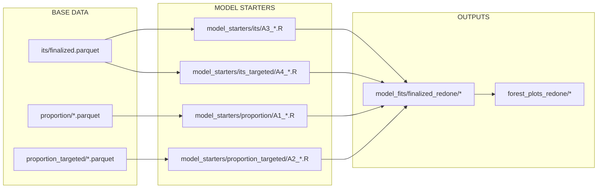

# Bayesian INGARCH Modeling Pipeline - Repository Catalogue

## Executive Summary

This repository implements a Bayesian multilevel INGARCH (Integer-valued Generalized Autoregressive Conditional Heteroskedasticity) modeling pipeline to analyze the effects of meat-plant-based alternative (MPBA) introductions on restaurant sales outcomes. The pipeline uses Stan for Bayesian inference and includes comprehensive data processing, model fitting, and visualization components.

---

## 1. Repository Structure

```
/home/nuttidalab/Documents/Jared/Other/testing/
|
|-- data/                          # Raw and processed data files
|-- model_scripts/                 # Core modeling logic
|-- model_starters/                # Individual model launch scripts
|-- models/                        # Stan model definitions
|-- model_fits/                    # Fitted model outputs (RDS files)
|-- logs/                          # Execution logs from tmux sessions
|-- forest_plots/                  # Visualization outputs (original)
|-- forest_plots_redone/           # Visualization outputs (finalized)
|-- forest_plots_restaurants/      # Per-restaurant visualizations
|-- customer_analysis/             # Alternative customer-level analyses
|-- diagnostic_scripts/            # Data quality and debugging scripts
|-- data_diagnostics/              # Diagnostic outputs
|-- tools/                         # Utility functions
|-- precursors/                    # Earlier analysis versions
|-- mlflow/ & mlruns/              # MLflow experiment tracking
|-- renv/                          # R environment management
|-- plots_final_grids/             # Final publication-ready plots
|-- run_t1_models.sh               # T1 model batch runner
|-- run_t2_models.sh               # T2 model batch runner
|-- create_forest_plots.R          # Forest plot generation
|-- create_forest_plots_restaurants.R  # Restaurant-level forest plots
```

---

## 2. Base Data: `data/4_data_parquet_modeling/`

**THIS IS THE STARTING DATA FOR ALL MODELS.** Everything in this directory is pre-processed and ready for modeling. The raw data files (`weekly_data.parquet`, `mpba_introductions.csv`, etc.) have already been transformed into these analysis-ready parquet files. You should ignore all other data directories and raw files.

### 2.1 Why This is the Base Data

The parquet files in `4_data_parquet_modeling/` are:
- **Pre-processed**: All data cleaning, joining, and transformation has been completed
- **Analysis-ready**: Each file contains the exact columns needed for its respective model type
- **Exposure-specific**: Proportion files are split by exposure variable to enable targeted modeling
- **Finalized**: The "finalized" prefix indicates these are the production-ready datasets

### 2.2 Directory Contents (In-Scope Only)

```
data/4_data_parquet_modeling/
|
|-- its/                              # Interrupted Time Series data
|   |-- finalized.parquet             # Single file for A3/A4 analyses (6.4 MB)
|
|-- proportion/                       # Menu Proportion data for A1
|   |-- finalized_mpbamod_dishes_count.parquet    # MPBA count exposure (6.1 MB)
|   |-- finalized_mpbamod_dishes_prop.parquet     # MPBA proportion exposure (6.1 MB)
|   |-- finalized_vegan_dishes_count.parquet      # Vegan count exposure (6.1 MB)
|   |-- finalized_vegan_dishes_prop.parquet       # Vegan proportion exposure (6.1 MB)
|   |-- finalized_vegetarian_dishes_count.parquet # Vegetarian count exposure (6.1 MB)
|   |-- finalized_vegetarian_dishes_prop.parquet  # Vegetarian proportion exposure (6.1 MB)
|
|-- proportion_targeted/              # Targeted Category Proportion data for A2
|   |-- finalized_breakfast_dishes_count.parquet    # Breakfast count (6.1 MB)
|   |-- finalized_breakfast_dishes_presence.parquet # Breakfast presence (6.1 MB)
|   |-- finalized_chicken_dishes_count.parquet      # Chicken count (6.1 MB)
|   |-- finalized_chicken_dishes_presence.parquet   # Chicken presence (6.1 MB)
|   |-- finalized_dairy_dishes_count.parquet        # Dairy count (6.1 MB)
|   |-- finalized_dairy_dishes_presence.parquet     # Dairy presence (6.1 MB)
|   |-- finalized_egg_dishes_count.parquet          # Egg count (6.1 MB)
|   |-- finalized_egg_dishes_presence.parquet       # Egg presence (6.1 MB)
|   |-- finalized_textured_dishes_count.parquet     # Textured count (6.1 MB)
|   |-- finalized_textured_dishes_presence.parquet  # Textured presence (6.1 MB)
|   |-- finalized_untextured_dishes_count.parquet   # Untextured count (6.1 MB)
|   |-- finalized_untextured_dishes_presence.parquet # Untextured presence (6.1 MB)
|
|-- customer/                         # NOT IN SCOPE - ignore
|   |-- finalized_customers.parquet
|   |-- finalized_transactions_customers.parquet
```

### 2.3 Data-to-Analysis Mapping

| Base Data File(s) | Analysis | Prereg | Models |
|-------------------|----------|--------|--------|
| `its/finalized.parquet` | **A3** ITS | A3 | 6 outcomes |
| `its/finalized.parquet` | **A4** ITS Targeted | A4 | 3 outcomes |
| `proportion/finalized_*.parquet` (6 files) | **A1** Proportion | A1 | 6 outcomes x 6 exposures = 36 |
| `proportion_targeted/finalized_*.parquet` (12 files) | **A2** Proportion Targeted | A2 | 6 categories x 2 exposure types = 12 |
| ~~`customer/*.parquet`~~ | ~~A5, A6~~ | - | **NOT IN SCOPE** |

### 2.4 Data Flow (Simplified)



### 2.5 Model Outputs

Each fitted model produces the following artifacts in `model_fits/<run>/<analysis>/<outcome>/`:

| File | Description |
|------|-------------|
| `fit.rds` | Full CmdStanR fit object (~500MB) |
| `summ.rds` | Summary statistics for all parameters |
| `samples.rds` | Posterior draws as data frame |
| `data_list.rds` | Stan data list used for fitting |
| `predictor_map.rds` | Mapping of predictor indices to names |
| `lambda_mean.rds` | Mean fitted intensity values (train) |
| `lambda_test_mean.rds` | Mean fitted intensity values (test) |
| `y_rep_mean.rds` | Mean posterior predictive (train) |
| `y_test_rep_mean.rds` | Mean posterior predictive (test) |
| `metadata.rds` | CmdStan metadata |
| `plots/` | Diagnostic visualization PNGs |

---

## 3. Key Scripts

### 3.1 Model Starters (`model_starters/`)

Individual R scripts that launch specific model configurations. Each calls functions from `run_analysis_finalized.R`.

| Directory | Analysis Type | Example Scripts |
|-----------|---------------|-----------------|
| `proportion/` | A1 - Menu proportion effects | `A1_chicken_fish_on_mpbamod_count.R`, `A1_meat_on_vegan_prop.R` |
| `proportion_targeted/` | A2 - Targeted category proportions | `A2_breakfast_count.R`, `A2_untextured_presence.R` |
| `its/` | A3 - Interrupted time series | `A3_nonvegan.R`, `A3_vegan.R` |
| `its_targeted/` | A4 - Targeted ITS | `A4_breakfast.R`, `A4_textured.R` |
| `customer/` | A5 - Customer-level | `A5_meat.R`, `A5_vegetarian.R` |
| `customer_targeted/` | A6 - Targeted customer | `A6_breakfast.R`, `A6_untextured.R` |
| `t2_*` | T2 versions of all above | Same structure with `_T2_` prefix |

**Starter Script Structure:**
```r
source(file.path("model_scripts", "analysis_scripts", "run_analysis_finalized.R"))

run_its(
    outcome = "nonvegan",
    restaurants_to_model = c('VLZX7K2M9QD4T', 'SRQS8F7JWA9MZ', ...),
    directory = "finalized_redone"
)
```

### 3.2 Core Scripts (`model_scripts/`)

| Script | Path | Purpose |
|--------|------|---------|
| `orchestrate_finalized.R` | `model_scripts/` | Defines restaurant lists and outcome variables |
| `orchestrate_one.R` | `model_scripts/` | Legacy single-model orchestration |
| `run_analysis_finalized.R` | `model_scripts/analysis_scripts/` | Defines wrapper functions for each analysis type |
| `run_analysis_nopred.R` | `model_scripts/analysis_scripts/` | Legacy analysis functions |
| `run_ingarch.R` | `model_scripts/ingarch_scripts/` | Core INGARCH fitting function |
| `1_data_ingarch.R` | `model_scripts/ingarch_scripts/` | Data preparation and design matrix creation |
| `2_index_ingarch.R` | `model_scripts/ingarch_scripts/` | Index computation for Stan data |
| `3_init_ingarch.R` | `model_scripts/ingarch_scripts/` | Parameter initialization functions |
| `4_plot_ingarch.R` | `model_scripts/ingarch_scripts/` | Diagnostic plotting functions |
| `view_params.R` | `model_scripts/` | Interactive parameter viewing |
| `view_params_funcs.R` | `model_scripts/` | Functions for extracting/transforming parameters |
| `plot_params.R` | `model_scripts/` | Parameter visualization |
| `plot_params_funcs.R` | `model_scripts/` | Plotting helper functions |

### 3.3 Visualization Scripts

| Script | Purpose |
|--------|---------|
| `create_forest_plots.R` | Generate forest plots for A1-A4 analyses |
| `create_forest_plots_restaurants.R` | Generate per-restaurant forest plots |

### 3.4 Shell Scripts

| Script | Purpose |
|--------|---------|
| `run_t1_models.sh` | Launch T1 (Tier 1) models in tmux sessions |
| `run_t2_models.sh` | Launch T2 (Tier 2) models in tmux sessions |

**Usage:**
```bash
./run_t1_models.sh  # Starts 25+ tmux sessions, ~75 CPU cores
./run_t2_models.sh  # Starts 70+ tmux sessions, ~210 CPU cores
```

---

## 4. Model Hierarchy

### 4.1 Analysis Types (A1-A4 Primary, A5-A6 Not in Scope)

| Code | Analysis | Data Source | Description | Status |
|------|----------|-------------|-------------|--------|
| **A1** | Proportion | `proportion/*.parquet` | Effect of menu proportions on sales (6 outcomes x 6 exposures = 36 models) | **PRIMARY** |
| **A2** | Proportion Targeted | `proportion_targeted/*.parquet` | Targeted category proportions - each category has own dataset | **PRIMARY** |
| **A3** | ITS | `its/finalized.parquet` | Interrupted time series (level + slope) - 6 outcomes | **PRIMARY** |
| **A4** | ITS Targeted | `its/finalized.parquet` | Targeted category ITS - 3 outcomes | **PRIMARY** |
| ~~A5~~ | ~~Customer~~ | ~~`customer/*.parquet`~~ | ~~Customer-level effects~~ | **NOT IN SCOPE** |
| ~~A6~~ | ~~Customer Targeted~~ | ~~`customer/*.parquet`~~ | ~~Targeted customer effects~~ | **NOT IN SCOPE** |

### 4.2 Outcomes

**Main Outcomes (A1, A3, A5):**
- `total` - Total sales
- `nonvegan` - Non-vegan item sales
- `meat` - Meat item sales
- `chicken_fish` - Chicken/fish sales
- `vegetarian` - Vegetarian item sales
- `vegan` - Vegan item sales

**Targeted Outcomes (A2, A4, A6):**
- `breakfast` / `breakfast_p` - Breakfast category
- `untextured` / `untextured_p` - Untextured plant proteins
- `textured` / `textured_p` - Textured plant proteins
- `chicken` / `chicken_p` - Chicken alternatives
- `dairy` / `dairy_p` - Dairy alternatives
- `egg` / `egg_p` - Egg alternatives

### 4.3 Exposures (A1, A2)

**A1 Proportion Exposures:**
- `mpbamod_dishes_count` / `mpbamod_dishes_prop`
- `vegan_dishes_count` / `vegan_dishes_prop`
- `vegetarian_dishes_count` / `vegetarian_dishes_prop`

**A2 Proportion Targeted Exposures:**
- `{category}_dishes_count` - Count of category dishes
- `{category}_dishes_presence` - Binary presence indicator

### 4.4 Time Periods (T1 vs T2)

| Period | Description | Restaurants |
|--------|-------------|-------------|
| **T1** | Tier 1 - Core restaurants | 6 restaurants with best data coverage |
| **T2** | Tier 2 - Extended set | 18 restaurants including T1 |

**T1 Restaurants:**
```
VLZX7K2M9QD4T, SRQS8F7JWA9MZ, 2HRX9P6HKXA8V, JHDN7CF1C03X5, L69HYJ4Y3TR91, ED5J990H5VAZT
```

**T2 Additional Restaurants:**
```
W8T41JZK0ZMEP, EMBVNVD207CC6, C0BE4NDSW26QN, V3Q26BHF3SE2H, LBZEEFSBJNB3Z,
SAFK7ND1HR6XS, CB2KHY1C2G9PT, S8MT0YGD2KTN9, LFZFT3VASXPED, 1SQPTEGYPH0GA,
9XKJD8DQTH559, LQ5EH4BKGV61T, 78AY09MVJVTYE
```

### 4.5 Restaurant Mapping to Analyses

From `orchestrate_finalized.R`:

```r
# A3/A4 ITS Targeted
targeted_its_restaurants <- list(
    breakfast = c('2HRX9P6HKXA8V','JHDN7CF1C03X5','L69HYJ4Y3TR91','ED5J990H5VAZT'),
    untextured = c('SRQS8F7JWA9MZ','JHDN7CF1C03X5'),
    textured = c('VLZX7K2M9QD4T'))

# A5/A6 Customer Targeted
targeted_customer_restaurants <- list(
    breakfast = c('2HRX9P6HKXA8V','L69HYJ4Y3TR91','ED5J990H5VAZT'),
    untextured = c('SRQS8F7JWA9MZ'))

# A2 Proportion Targeted (T1)
targeted_proportion_restaurants <- list(
    untextured = c('JHDN7CF1C03X5', 'SRQS8F7JWA9MZ', 'W8T41JZK0ZMEP'),
    breakfast = c('2HRX9P6HKXA8V', 'ED5J990H5VAZT', 'JHDN7CF1C03X5', 'L69HYJ4Y3TR91', 'W8T41JZK0ZMEP'),
    chicken = c('JHDN7CF1C03X5', 'W8T41JZK0ZMEP'),
    dairy = c('ED5J990H5VAZT', 'JHDN7CF1C03X5', 'W8T41JZK0ZMEP'),
    egg = c('ED5J990H5VAZT','W8T41JZK0ZMEP'))
```

---

## 5. Stan Model Architecture

### 5.1 Model File

**Path:** `models/model_multilevel_transfer.stan`

### 5.2 Model Structure

The model implements a **multilevel negative binomial INGARCH** with:

**Data Block:**
- `R` - Number of restaurants
- `J` - Number of covariates
- `M` - Number of transfer function parameters (exposures)
- `p_effective` - Effective outcome lags
- `q_effective` - Effective latent intensity lags
- Train/test data matrices and indices

**Parameters:**
1. **Global Effects (mu_*):**
   - `mu_gamma[M]` - **PRIMARY ESTIMATE**: Global exposure effect
   - `mu_beta_intercept`, `mu_beta_random[K]`, `mu_beta_fixed[K]`
   - `mu_alpha_*`, `mu_delta_*` - INGARCH lag parameters
   - `mu_phi_log` - Dispersion

2. **Between-Restaurant Variability (sigma_*):**
   - `sigma_gamma_between[M]` - Exposure effect heterogeneity across restaurants
   - `sigma_beta_*`, `sigma_alpha_*`, `sigma_delta_*`, `sigma_phi_log`

3. **Within-Restaurant Variability:**
   - `sigma_gamma_within[M]` - Exposure effect heterogeneity within restaurants

4. **Local/Random Effects:**
   - `z_*` - Non-centered parameterization deviates
   - `eta[M, R]` - Per-restaurant exposure effects

**Transformed Parameters:**
- `beta[J, R]` - Restaurant-specific predictor coefficients
- `alpha[p, R]` - Outcome lag coefficients (tanh-bounded to [-1,1])
- `delta[q, R]` - Intensity lag coefficients (tanh-bounded)
- `phi[R]` - Restaurant-specific dispersion
- `nu`, `lambda` - Log-linear predictor and intensity

**Model Block:**
- Laplace priors for predictor coefficients (shrinkage)
- Normal priors for exposure effects
- Exponential priors for variance components
- Negative binomial likelihood: `y ~ neg_binomial_2(lambda, phi)`

**Generated Quantities:**
- `y_rep[N_train]` - Posterior predictive samples
- `log_lik[N_train]` - Pointwise log-likelihood
- `y_test_rep[N_test]` - Test set predictions
- `lambda_test[N_test]` - Test set intensities

### 5.3 INGARCH Structural Model

```
nu[t] = X[t] * beta + sum(alpha[i] * log(y[t-i] + 1)) + sum(delta[j] * nu[t-j])
lambda[t] = exp(nu[t])
```

**Default Lags:**
```r
effective_lags_alpha = c(1, 2, 3, 4, 5, 6, 7, 14, 21, 28, 35, 42)
effective_lags_delta = c(1, 2, 3, 4, 5, 6, 7, 14, 21, 28, 35, 42)
random_lags_alpha_values = c(1, 7)  # Random effects for these lags
random_lags_delta_values = c(1, 7)
```

---

## 6. Dependencies

### 6.1 R Packages

**Core Modeling:**
- `cmdstanr` - CmdStan interface for Stan
- `posterior` - Posterior analysis
- `bayesforecast` - ACF/PACF functions

**Data Processing:**
- `tidyverse` (dplyr, tidyr, ggplot2, purrr, stringr, lubridate)
- `arrow` - Parquet file I/O
- `conflicted` - Namespace conflict resolution

**Visualization:**
- `ggplot2`, `patchwork`, `plotly`, `htmlwidgets`
- `gt` - Table formatting
- `gridExtra`, `grid`

**Experiment Tracking:**
- `mlflow` - MLflow integration
- `reticulate` - Python interface for MLflow

**Parallel Processing:**
- `future`, `furrr` - Parallel map operations

**Environment:**
- `renv` - Package management
- `rprojroot` - Project root detection

### 6.2 External Tools

- **Stan/CmdStan** - Bayesian inference engine
- **tmux** - Terminal multiplexer for parallel model runs
- **MLflow** - Experiment tracking server

### 6.3 Environment Setup

```r
# .Rprofile activates renv
source("renv/activate.R")

# Conflict preferences
c("select", "filter") %>% walk(~ conflict_prefer(.x, "dplyr"))
c("year", "month") %>% walk(~ conflict_prefer(.x, "lubridate"))
c("map") %>% walk(~ conflict_prefer(.x, "purrr"))
```

---

## 7. Output Artifacts

### 7.1 Model Fits Directory Structure

```
model_fits/
|-- finalized/                    # Original finalized run
|-- finalized_redone/             # Current production run
|   |-- its/
|   |   |-- chicken_fish/
|   |   |-- meat/
|   |   |-- nonvegan/
|   |   |-- total/
|   |   |-- vegan/
|   |   |-- vegetarian/
|   |-- its_targeted/
|   |   |-- breakfast/
|   |   |-- textured/
|   |   |-- untextured/
|   |-- proportion/
|   |   |-- chicken_fish/
|   |   |   |-- mpbamod_dishes_count/
|   |   |   |-- mpbamod_dishes_prop/
|   |   |   |-- vegan_dishes_count/
|   |   |   |-- ...
|   |   |-- meat/
|   |   |-- ...
|   |-- proportion_targeted/
|   |-- t2_proportion/
|-- testing*/                     # Various test runs
|-- empirical/
|-- official*/
```

### 7.2 Forest Plots

```
forest_plots_redone/
|-- A1_proportion_forest.png/.pdf/.html
|-- A1_proportion_mu_gamma.csv
|-- A2_proportion_targeted_forest.png/.pdf/.html
|-- A2_proportion_targeted_mu_gamma.csv
|-- A3_its_forest.png/.pdf/.html
|-- A3_its_mu_gamma.csv
|-- A4_its_targeted_forest.png/.pdf/.html
|-- A4_its_targeted_mu_gamma.csv
```

### 7.3 Logs

Model execution logs are stored in `logs/` with naming convention:
```
A{analysis}_{outcome_abbrev}.log
A{analysis}T2_{outcome_abbrev}.log  # For T2 models
```

Examples:
- `A1_c_f_o_m_c.log` - A1, chicken_fish on mpbamod, count
- `A3_n.log` - A3 ITS, nonvegan
- `A1T2_v_o_v_p.log` - A1 T2, vegan on vegan, proportion

---

## 8. Predictors

### 8.1 Random Predictors (Hierarchical)

```r
random_predictors = c(
    "vegan_price_real",      # continuous
    "vegetarian_price_real", # continuous
    "meat_price_real",       # continuous
    "weekend",               # binary
    "holiday_window",        # binary
    "month_cat",             # factor
    "season",                # factor
    "year_cat",              # factor
    "date_num"               # continuous (time trend)
)
```

### 8.2 Fixed Predictors (Non-hierarchical)

```r
fixed_predictors = c(
    "day_of_week_cat",  # factor
    "inflation",        # continuous
    "temp",             # continuous
    "precip"            # continuous
)
```

### 8.3 Exposure Predictors

Dynamically identified from data columns matching restaurant IDs:
- `exposure_{restaurant_id}_{intervention_number}` - Step function
- `exposure_{restaurant_id}_{intervention_number}_slope` - Slope function (if `include_slopes=TRUE`)

---

## 9. Execution Workflow

### 9.1 Single Model

```bash
Rscript model_starters/its/A3_nonvegan.R 2>&1 | tee logs/A3_n.log
```

### 9.2 Batch Execution

```bash
# Run all T1 models
./run_t1_models.sh

# Run all T2 models
./run_t2_models.sh

# Monitor sessions
tmux ls
tmux attach -t A3_n

# Kill all sessions
tmux kill-server
```

### 9.3 Generate Visualizations

```r
source("create_forest_plots.R")
```

---

## 10. Key Configuration Parameters

### 10.1 Sampling Parameters

```r
chains = 3
parallel_chains = 3
iter_warmup = 700
iter_sampling = 1500
adapt_delta = 0.85  # or 0.95
max_treedepth = 10  # or 12
```

### 10.2 Data Split

```r
train_frac = 0.95  # 95% train, 5% test
```

### 10.3 Hyperprior Scales

```r
mu_gamma_scale_input = 1.0
sigma_gamma_between_scale_input = 1.0
sigma_gamma_within_scale_input = 1.0
mu_beta_scale_input = 1.0
sigma_beta_scale_input = 1.0
mu_alpha_scale_input = 1.0
sigma_alpha_scale_input = 1.0
mu_delta_scale_input = 1.0
sigma_delta_scale_input = 1.0
mu_phi_log_scale_input = 1.0
sigma_phi_log_scale_input = 1.0
```

---

## 11. Diagnostic and Support Scripts

### 11.1 Data Diagnostics (`diagnostic_scripts/`)

| Script | Purpose |
|--------|---------|
| `analyze_exposures.R` | Examine exposure variable distributions |
| `analyze_restaurant_specific.R` | Restaurant-level data quality |
| `check_actual_values.R` | Verify outcome values |
| `check_srq_separation.R` | Check for separation issues |
| `summarize_problematic_restaurants.R` | Identify data issues |

### 11.2 Customer Analysis (`customer_analysis/`)

Alternative frequentist analysis using `fixest`:
- `run_customer_fixest.R` - Fixed effects models
- `run_all_analyses.R` - Batch customer analysis
- `model_functions.R` - Helper functions

---

## 12. MPBA Interventions Reference

From `data/mpba_introductions.csv`:

| Restaurant | Intervention Date | Product |
|------------|-------------------|---------|
| VLZX7K2M9QD4T | 2021-10-18 | Black Sheep |
| SRQS8F7JWA9MZ | 2020-06-25 | Beyond Burger |
| SRQS8F7JWA9MZ | 2020-09-09 | Impossible |
| 2HRX9P6HKXA8V | 2019-06-05 | Beyond Sausage |
| JHDN7CF1C03X5 | 2019-09-06 | Beyond Burger |
| JHDN7CF1C03X5 | 2020-03-12 | Beyond Sausage |
| L69HYJ4Y3TR91 | 2023-01-10 | Impossible Sausage |
| ED5J990H5VAZT | 2021-10-01 | Vegan Bacon |
| W8T41JZK0ZMEP | 2021-03-06 | Vegan Breakfast Sandwich |
| EMBVNVD207CC6 | 2020-09-03 | Vegan |
| C0BE4NDSW26QN | 2018-05-24 | Impossible Burger |
| C0BE4NDSW26QN | 2019-09-03 | Beyond Burger |
| 75WYSXR9QBK5M | 2023-01-31 | Kimchi Veggie Burger |
| V3Q26BHF3SE2H | 2021-03-24 | Beyond Sausage |
| LBZEEFSBJNB3Z | 2022-02-03 | Vegan Wake And Fake |
| SAFK7ND1HR6XS | 2019-09-11 | Chile Verde Jackfruits Taco |
| CB2KHY1C2G9PT | 2020-07-03 | Beyond Meat Patty Melt |
| S8MT0YGD2KTN9 | 2019-03-11 | Vegan Burger |
| LFZFT3VASXPED | 2022-04-07 | Better Than Beyond |
| 1SQPTEGYPH0GA | 2020-06-14 | Impossible Meatball |
| 9XKJD8DQTH559 | 2021-07-28 | Impossible Beef |
| LQ5EH4BKGV61T | 2023-01-06 | Beyond Burger |
| 78AY09MVJVTYE | 2015-08-09 | Veggie Sausage |

---

## 13. Version Control Notes

**Current Branch:** `reviewer`

**Main Branch:** `main`

**Recent Commits:**
- `32b7fe4` - so more logs
- `d6278a6` - a few more models and then the redone plots
- `e19b44a` - finalized_redone, many models done

**Untracked/Modified:**
- Modified log files in `logs/`
- New `model_fits/finalized_redone/its_targeted/breakfast/`
- This `review/` directory

---

## 14. Quick Reference Tables

### 14.1 Analysis Summary

**Primary Analyses (In Scope):**

| Analysis | Script Pattern | Data Source | Outcomes | Models Count |
|----------|----------------|-------------|----------|--------------|
| A1 | `A1_*_on_*_{count,prop}.R` | `4_data_parquet_modeling/proportion/*.parquet` | 6 | 36 |
| A2 | `A2_*_{count,presence}.R` | `4_data_parquet_modeling/proportion_targeted/*.parquet` | 5 | 10 |
| A3 | `A3_*.R` | `4_data_parquet_modeling/its/finalized.parquet` | 6 | 6 |
| A4 | `A4_*.R` | `4_data_parquet_modeling/its/finalized.parquet` | 3 | 3 |

**Not In Scope (Ignore):**

| Analysis | Script Pattern | Data Source | Status |
|----------|----------------|-------------|--------|
| ~~A5~~ | `A5_*.R` | `customer/*.parquet` | NOT IN SCOPE |
| ~~A6~~ | `A6_*.R` | `customer/*.parquet` | NOT IN SCOPE |

### 14.2 File Type Reference

| Extension | Tool | Description |
|-----------|------|-------------|
| `.parquet` | arrow | Columnar data storage |
| `.rds` | R | Serialized R objects |
| `.stan` | CmdStan | Stan model definitions |
| `.R` | R | R scripts |
| `.sh` | Bash | Shell scripts |
| `.log` | Text | Execution logs |
| `.png/.pdf` | Image | Visualizations |
| `.html` | HTML | Interactive plots |
| `.csv` | CSV | Tabular exports |

---

*Catalogue generated: 2026-01-12*
*Document location: `/home/nuttidalab/Documents/Jared/Other/testing/review/catalogue.md`*
