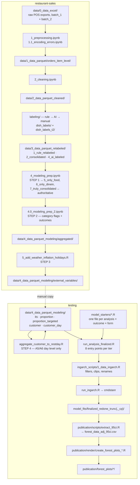

# Workflow sequence — end to end, across both repos

Written 2026-08-01. Covers every stage from raw Excel exports to the publication
figures, which scripts are live, which are antiquated, and where data lands at
each hop.

Two repos:

| repo | role |
|---|---|
| `restaurant-sales` | data construction — raw POS exports → model-ready parquets |
| `testing` (`alt-protein-sales-effects`) | modelling, extraction, figures |

The handoff is a **manual copy** of ~21 parquet files. There is no automated
sync; see [The handoff](#the-handoff) for the exact mapping.

---

## Diagram



---

## Stage by stage

### `restaurant-sales` — data construction

| # | script | in | out |
|---|---|---|---|
| 1 | `1_preprocessing.ipynb` (+ `1.1_encoding_errors.ipynb`) | `data/0_data_excel/batch_{1,2}/` | `data/1_data_parquet/orders_item_level/` |
| 2 | `2_cleaning.ipynb` | ↑ | `data/2_data_parquet_cleaned/orders_item_level/` |
| 3 | `labeling/` (see below) | ↑ | `data/3_data_parquet_relabeled/{1_rule_relabeled,2_consolidated,4_ai_labeled}/` |
| 4 | `4_modeling_prep.ipynb` — **STEP 1** | ↑ + `grouping_mappings.pkl` | `3_data_parquet_relabeled/5_only_food/`, `6_only_dinein/`, `7_truly_consolidated/` |
| 5 | `4.0_modeling_prep_2.ipynb` — **STEP 2** | `7_truly_consolidated/` | `4_data_parquet_modeling/aggregated/` |
| 6 | `5_add_weather_inflation_holidays.R` — **STEP 3** | `aggregated/` + weather + CPI | `4_data_parquet_modeling/external_variables/` |

`5_format_weather_and_inflation_data.R` is a **prerequisite**, run once, producing
`data/weather_data/finalized_weather_data/weather_data.csv` and the CPI table.
It does not need re-running unless the coverage window changes.

**Run order is strict — 4 → 4.0 → 5.** Step 2 is the memory hog (15.8 GB peak,
~4 min; steps 1 and 3 are 1:20/4.0 GB and 1:19/1.0 GB).

#### The labeling subtree

`scripts/labeling/` holds the dish-level ground truth:

| path | contents |
|---|---|
| `dish_labels/` | **Tier 1** per-restaurant CSVs, one row per dish, one boolean column per category |
| `dish_labels_t2/` | **Tier 2** — superset, `<RESTAURANT>_1.csv` naming |
| `dish_labels_backup/` | snapshot, not read by the pipeline |
| `dish_counts/` | per-dish unit tallies used for auditing |
| `ai_grouping/`, `labeling_1/`, `labeling_2/`, `remapping/` | intermediate stages of the rule → AI → manual labeling |
| `checking_labels.ipynb`, `labeling_template.ipynb` | interactive tools |

The 14 category columns are: `lamb`, `chunked_beef_or_pork`, `pulled_pork`,
`beef_or_pork_burger`, `ground_meat`, `meatballs`, `sausage`, `bacon`,
`breakfast_sausage_patty`, `unfried_chicken`, `fried_chicken`, `savory_dairy`,
`sweet_dairy`, `egg`.

#### Where outcomes are actually built

`4.0_modeling_prep_2.ipynb` **cell 2** — `category_mappings` (per-category
include/anti keyword regexes) and the mask chain that turns label-CSV joins into
transaction-level flags. This is the file to edit for any labelling-logic fix;
`4.3_targeted_categories.ipynb` only makes things binary and is **not** where
construction happens.

**cell 3** builds the general outcomes, **cell 4** the targeted ones, **cell 6**
aggregates to restaurant-day.

### The handoff

Manual copy, `restaurant-sales/data/4_data_parquet_modeling/external_variables/`
→ `testing/data/4_data_parquet_modeling/`:

| source | dest | files |
|---|---|---|
| `its/` | `its/` | 1 |
| `proportion/` | `proportion/` | 6 |
| `proportion_targeted/` | `proportion_targeted/` | 12 |
| `customer/` | `customer/` | 2 |

`testing`'s `a2_proportion_t/` is a **symlink to `proportion_targeted/`** — do not
copy into both, they are the same directory.

No rename is needed. Both sides carry `*_outcome_p`; `1_data_ingarch.R:133`
conditionally renames to `*_p_outcome` at load time.

### `testing` — modelling

| # | script | role |
|---|---|---|
| 4 | `model_scripts/customer_analysis/level_day/aggregate_customer_to_restday.R` | **STEP 4** — the only stage `restaurant-sales` does not produce. Reads `customer/finalized_transactions_customers.parquet`, demeans per customer, aggregates → `customer_day/finalized.parquet` (~5 min, 4.4 GB) |
| 5 | `model_starters/<family>/<A#>_<outcome>_<form>.R` | thin config: outcome, exposure, restaurant list, price predictor, output dir |
| 6 | `model_scripts/analysis_scripts/run_analysis_finalized.R` | 8 entry points per tier, resolves the data file |
| 7 | `model_scripts/ingarch_scripts/1_data_ingarch.R` | universal date filters, clip tables, `*_outcome_p` → `*_p_outcome` rename |
| 8 | `model_scripts/ingarch_scripts/run_ingarch.R` | builds the Stan data list, calls cmdstanr |
| 9 | `model_fits/<directory>/<analysis>/<outcome>/<exposure>/` | `fit.rds`, `samples.rds`, `restaurants_order.rds` |

Starters are launched directly (`Rscript model_starters/.../A2_dairy_count.R`) or
in batches via `bash_scripts/running/*.sh` locally, `bash_scripts/slurm/*.sh` on
Sherlock. `bash_scripts/moving/` holds the scp helpers.

### `testing` — extraction and figures

| # | script | role |
|---|---|---|
| 10 | `publication/scripts/extract_95ci.R` | walks fit dirs, pulls per-fit draws → `publication/forest_data_adj_95ci.csv` |
| 11 | `publication/render/create_forest_plots_restaurants_chosen_recolored_adj{,_t2}.R` | reads the CSV, builds A1–A6 forest plots |
| 12 | `publication/render/render_professional_wide*.R` | wrappers setting the env-var switches |
| 13 | `publication/forest_plots/<variant>/` | output PDFs/PNGs |

**Renderers read the CSV, never `samples.rds`.** Samples are multi-GB; loading
them at plot time is the thing this split exists to avoid.

Env-var switches consumed by the renderers: `SORT_BY_MEAN`, `PUB_RECENTER`,
`PUB_WIDE`, `LABELED_MODE`, `LABELED_V2`, `WIDE_LABELED`, `PRO_ONLY`, `PRO_TIER`,
`PRO_FAST`. Layout constants live in `publication/config/plot_config.R`
(`PLOT_CONFIG` + `WIDE_OVERRIDES` + `LABELED_OVERRIDES`, merged by
`get_plot_cfg()`) and `publication/config/publication_theme.R`.

---

## Analyses → data files

Six analyses × two tiers, but **eight** `run_*` entry points per tier, because A5
and A6 each have a day-level and a transaction-level variant. Files are shared:

| entry point | analysis | data file | affected by the contamination fix? |
|---|---|---|---|
| `run_proportion` | A1 general availability | `proportion/finalized_<expo>.parquet` | no |
| `run_prop_targeted` | A2 targeted availability | `a2_proportion_t/finalized_<expo>.parquet` | **yes** |
| `run_its` | A3 general ITS | `its/finalized.parquet` | no |
| `run_its_targeted` | A4 targeted ITS | `its/finalized.parquet` *(same file)* | **yes** |
| `run_customer_day` | A5 within-customer, day | `customer_day/finalized.parquet` | no |
| `run_customer` | A5 within-customer, transaction | `customer/finalized_transactions_customers.parquet` | no |
| `run_customer_targeted_day` | A6 targeted, day | `customer_day/finalized.parquet` *(same file)* | **yes** |
| `run_customer_targeted` | A6 targeted, transaction | `customer/finalized_transactions_customers.parquet` *(same)* | **yes** |

A3/A4 and A5/A6 differ only in which columns they select, which is why 21 files
cover 16 entry points.

Tier 2 entry points are the same functions in the second half of
`run_analysis_finalized.R`, fed by `model_starters/t2_a*/`.

---

## Gotchas that will bite

### Environment must be pinned
Run the notebooks under `env/environment_linux.yml` (conda env `palate1`:
python 3.9.25, pandas 2.1.3, numpy 1.22.4, pyarrow 14.0.1). **pandas 3.0 silently
corrupts** numeric dish-count columns into `'True'`/`'False'` strings. Set
`PYTHONPATH=/home/godli/restaurant-sales/src` **absolute** — the notebook calls
`os.chdir(PROJECT_ROOT)`, so a relative path breaks.

### R invocation
`.Rprofile` sources a missing `renv/activate.R`, so `--vanilla` is required — but
that drops `R_LIBS_USER`. Use:
```
Rscript --vanilla -e '.libPaths(c("/home/godli/R/x86_64-pc-linux-gnu-library/4.3", .libPaths())); source("<script>")'
```

### The transactions file needs manual line swaps
`5_add_weather_inflation_holidays.R` processes the 20 **daily** aggregates and
excludes `transactions`. To produce
`customer/finalized_transactions_customers.parquet` you must toggle four lines:

| line | daily | transactions |
|---|---|---|
| 125–126 | commented | **active** — casts `created_at` to a date before joining |
| 127 | active | commented |
| 135 | active | commented |
| 136 | commented | **active** — the `all_locations_transactions → finalized_transactions` rename |

Lines 125–126 are not cosmetic. `created_at` is POSIXct in the transaction-level
data; the direct join at line 127 matches almost nothing — **73 % NA weather**,
and the 27 % that survive are biased to overnight rows (mean temp 2.9 °C vs the
correct 14.0 °C). No error is raised.

### `4.0_modeling_prep_2.ipynb` always exits 1
Cell 12 reads `all_locations_transaction_customers.parquet` (singular) while cell
10 writes `...transactions_customers.parquet` (plural). Cells 13–15 are fully
commented, so **no output is lost** — every data-producing cell runs first. The
non-zero exit is expected; check the files, not the exit code.

Likewise `5_add_weather_inflation_holidays.R` exits 1 on a post-loop `gg_season`
diagnostic (`validate_tsibble` on transaction-level data). Also after the write.

### `*_outcome_p` must be a union, not a sum — FIXED
Historically each `*_outcome_p` was a **sum of 2–3 category flags**, e.g.
`breakfast_outcome_p = 1*sausage + 1*bacon + 1*breakfast_sausage_patty`. Because
`total_outcome = 1` per item row, any dish flagged in two categories of the same
group contributed **2**, and `outcome_p` could exceed `total_outcome`. `egg_p`,
the only single-flag group, was the only one that never exceeded — which is what
identified the mechanism.

The outcome is *counterpart items purchased*, and the unit is one item row. A
Breakfast Burrito is one purchase whether it holds bacon, sausage, or both.
Cell 4 already built the correct boolean union (`breakfast_p = sausage | bacon |
breakfast_sausage_patty`) and used it for the price windows that become
`*_p_price_real` — A2's `extra_price_predictor`. So the outcome and its own price
covariate were defined differently within the same model.

Fixed in `4.0_modeling_prep_2.ipynb` cell 4 by pointing the six outcomes at the
union already computed above, matching the `*_outcome = 1*df['<flag>']` pattern:

```python
breakfast_outcome_p=lambda df: 1*df['breakfast_p'],
textured_outcome_p=lambda df: 1*df['textured_p'],
untextured_outcome_p=lambda df: 1*df['untextured_p'],
chicken_outcome_p=lambda df: 1*df['chicken_p'],
dairy_outcome_p=lambda df: 1*df['dairy_p'],
egg_outcome_p=lambda df: 1*df['egg_p'],
```

Effect: exceedances 2,226 → **0**, and `outcome_p <= total_outcome` now holds by
construction. 221,391 phantom units removed —
`breakfast_p` −15.0 %, `textured_p` −7.4 %, `dairy_p` −1.6 %, `chicken_p` and
`untextured_p` −0.2 %, `egg_p` unchanged. Exactly five columns moved; the other
188 in `its/finalized.parquet` are bit-identical.

**Scope: A2 only, both tiers.** A4 and A6 read `*_outcome` / `*_t2_outcome`,
built by `targeted_from_map`, which assigns one category per restaurant and never
summed. A1/A3/A5 are general outcomes and were never involved.

Note for anyone reading old results: this was never a *likelihood* violation.
`total_outcome` is used in exactly one place (`run_ingarch.R:270-273`) — days
where it is 0 are closed days, dropped from the likelihood — and is never an
offset or denominator. Verified 0 rows had `total_outcome == 0` with
`outcome_p > 0`, so no purchases were ever silently discarded. The sum inflated
counts; it did not corrupt the fit mechanics.

### Dead / never-firing code in `1_data_ingarch.R`
- `is_proportion <- grepl("/a1_proportion/", data_dir)` — never TRUE; the real
  path is `.../proportion/...`, so `clip_dates_proportion` has **never been
  applied in either tier**.
- `apply_proportion_clips()` returns early for `its/` paths, so
  `clip_dates_proportion_targeted` is bypassed for A3 and A4 — the two designs
  where onset confounding actually matters.
- Line 143: JHDN7CF1C03X5's **start** clip is commented out; only the end clip
  applies.

### Repo size
`testing`'s pack is 5.73 GiB and the derived parquets are tracked.
`customer/finalized_transactions_customers.parquet` is 67.9 MB, above GitHub's
50 MB warning threshold. Every regeneration adds another full copy. Consider LFS
or untracking the derived parquets before the next cycle.

---

## Antiquated — do not use

### Data
| path | why |
|---|---|
| `3_data_parquet_relabeled/7_with_targeted/` | **does not reconcile** with modelled totals (V3Q26B chicken: 1 unit there vs 503 modelled). Use `7_truly_consolidated/`. |
| `data/2.1_data_parquet_misclassified/` | diagnostic branch from the cleaning stage |
| `data/1.1_data_excel_redone/` | re-export of a subset of batch inputs |
| `testing/.../customer_day/finalized_customer_day_*.parquet` (6 files) | **no script on the current path writes them** and nothing in `run_analysis_finalized.R` reads them — orphaned from an earlier per-outcome layout. Stale but inert. (`level_day/stan_gaussian/aggregate_customer_data.R` writes a *different* file, `customer_analysis/day/finalized_customer_day.parquet`.) |
| `testing/.../rename_proportion_targeted.R` | redundant — `1_data_ingarch.R:133` does the rename at load time |

### Model fits
`model_fits/` holds 12 generations. Current: **`finalized_redone_trunc`** and
**`finalized_redone_trunc_cp`** (`_cp` preferred where both exist; `_cp` over
`_trunc` where both exist). Superseded: `finalized_redone`, `finalized_redone2`
… `finalized_redone5`, `finalized_redone_zi{,2,3}`, `finalized_simple`,
`testing`. A `finalized_redone_trunc_cp2` appears in `forest_data_95ci.csv`
(a5_customer_day rows) but **the directory does not exist locally** — it was a
Sherlock-side run that was never brought back.

### Extraction
| path | status |
|---|---|
| `publication/scripts/retired/` | holds `extract_adj_95ci.R`, retired at commit `1c9a25b1` (Bug 1 source), with a provenance note |
| `forest_data_95ci.csv` | pre-adjustment; superseded by `forest_data_adj_95ci.csv` |
| `forest_data_all.csv`, `forest_data_adj_95ci_fixed.csv`, `forest_data_adj_95ci_t2_a3_a4.csv` | intermediate passes |
| `adj_fallback.R`, `forest_fallback.R`, `adj_join_pass2.R`, `extract_*_only.R` | one-off repair passes for specific re-runs |

### Renderers
Current: `create_forest_plots_restaurants_chosen_recolored_adj{,_t2}.R`, driven by
`render_professional_wide{,_fixed,_labeled}.R`. Superseded, kept for comparison:
`create_forest_plots_chosen.R`, `..._restaurants_chosen.R`,
`..._recolored.R`, `..._recolored_t2.R`, and the `_overlay` pair.

Output folders, current → `professional_wide_fixed/`, `wide_labeled/`.
Kept deliberately as references (**do not overwrite**):
`professional_labeled/`, `professional_labeled_v2/`. Superseded: `base/`,
`professional/`, `professional_2/`, `professional_recentered/`,
`z_log_and_overlay/`, `z_precursors/`.

### Scripts
| path | status |
|---|---|
| `restaurant-sales/scripts/unused/` | self-describing — `empirical_multilevel*.R`, `tidymodels_integration*.R`, `other_modeling/` |
| `restaurant-sales/scripts/5.1`–`5.4.2`, `6_customer_modeling.R` | earlier modelling attempts, superseded by the `testing` repo entirely |
| `restaurant-sales/scripts/3.1`–`3.4`, `4.1`–`4.5` | exploratory / auditing notebooks, not on the production path |
| `testing/model_scripts/analysis_scripts/run_analysis.R`, `run_analysis_two.R`, `run_analysis_nopred.R` | superseded by `run_analysis_finalized.R` (`run_analysis_nopred.R` is the only reader of `customer/finalized_customers.parquet`) |
| `testing/model_scripts/ingarch_scripts/run_ingarch_zi.R`, `3_init_ingarch_zi.R`, `run_ingarch_group2.R` | zero-inflated and grouped variants, not in the current figure set |
| `testing/model_scripts/customer_analysis/level_*/fixest/` | frequentist cross-check, not the published estimates |
| `testing/archive/` | prior versions wholesale |

---

## Reproducing from scratch

```bash
# --- restaurant-sales ---
conda activate palate1
cd /home/godli/restaurant-sales
export PYTHONPATH=/home/godli/restaurant-sales/src

jupyter nbconvert --to notebook --execute scripts/4_modeling_prep.ipynb      # STEP 1
jupyter nbconvert --to notebook --execute scripts/4.0_modeling_prep_2.ipynb  # STEP 2 (exits 1; expected)

Rscript --vanilla -e '.libPaths(c("/home/godli/R/x86_64-pc-linux-gnu-library/4.3",.libPaths())); source("scripts/5_add_weather_inflation_holidays.R")'   # STEP 3, 20 daily files
# then toggle lines 125-127 / 135-136 and re-run for the transactions file

# --- handoff ---
cp external_variables/{its,proportion,proportion_targeted,customer}/*.parquet  <matching testing dirs>

# --- testing ---
cd /home/godli/testing
Rscript --vanilla -e '.libPaths(...); source("model_scripts/customer_analysis/level_day/aggregate_customer_to_restday.R")'   # STEP 4
Rscript model_starters/a2_proportion_t/A2_dairy_count.R          # per model
Rscript publication/scripts/extract_95ci.R                           # → forest_data_adj_95ci.csv
Rscript publication/render/render_professional_wide_fixed.R          # → forest_plots/
```

Verify after any data regeneration: general outcomes (`vegan`, `vegetarian`,
`total`, `nonvegan`, `meat`, `chicken_fish`) must be **bit-identical** unless the
change was deliberately general; only targeted outcomes should move.

---

## Related documents

- `review/t1_overlap_audit.md` — Tier 1 soundness, no changes proposed
- `review/t2_problem_list.md` — the three mechanisms behind bad T2 estimates
- `review/t2_onset_confound_findings.md` — what the overlap review missed
- `review/contamination_fix_proposal.md` — the fix applied at `fd44b90`
- `publication/style_policy.md` — figure conventions
